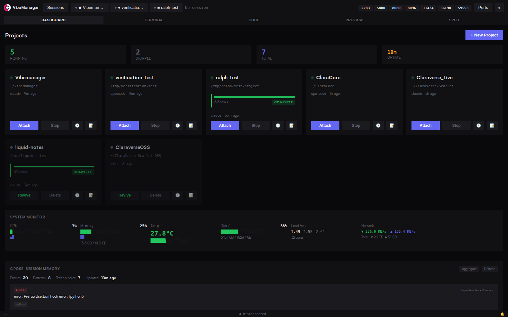
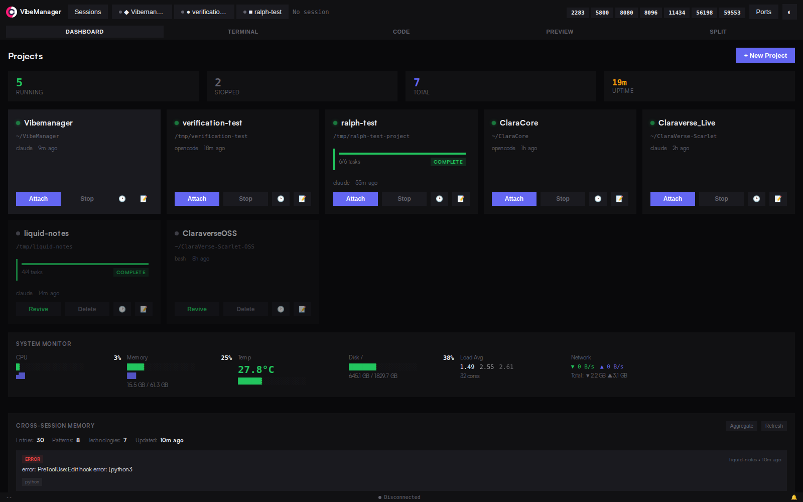
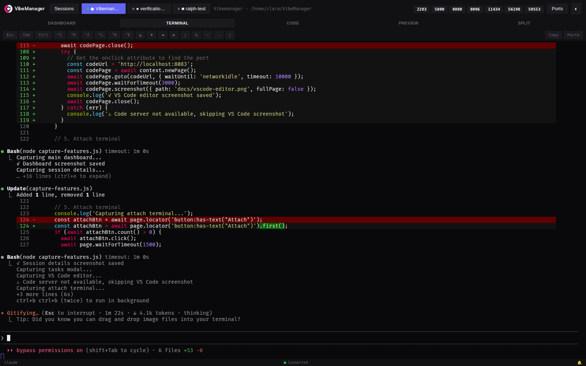
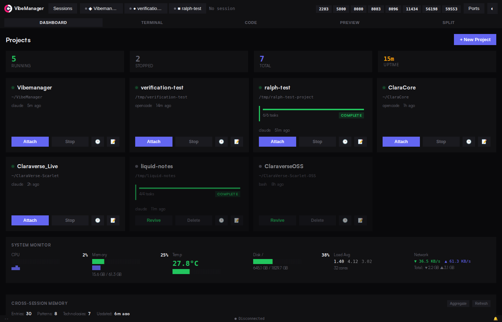

# VibeManager

**AI Coding Session Manager** - Run multiple autonomous AI coding agents (Claude Code, OpenCode) and monitor them from a single dashboard.

Perfect for kicking off multiple AI coding sessions on your Raspberry Pi or server, then checking back later to see what they've built.

```
  _    _____ __          __  ___
 | |  / /  _/ /_  ___   /  |/  /___ _____  ____ _____ ____  _____
 | | / // // __ \/ _ \ / /|_/ / __ `/ __ \/ __ `/ __ `/ _ \/ ___/
 | |/ // // /_/ /  __// /  / / /_/ / / / / /_/ / /_/ /  __/ /
 |___/___/_.___/\___//_/  /_/\__,_/_/ /_/\__,_/\__, /\___/_/
                                              /____/
```

## 🚀 Quick Start

```bash
# Install
curl -fsSL https://raw.githubusercontent.com/claraverse-space/VibeManager/master/install.sh | bash

# Update
curl -fsSL https://raw.githubusercontent.com/claraverse-space/VibeManager/master/install.sh | bash -s -- --update

# Uninstall
curl -fsSL https://raw.githubusercontent.com/claraverse-space/VibeManager/master/install.sh | bash -s -- --uninstall
```

Access at: **http://localhost:3131**

---

## 📸 Features Overview

### 🎯 Main Dashboard - Manage All Your AI Sessions

Monitor multiple AI coding sessions from a single interface. Each session card shows:
- **Project name and path**
- **AI agent type** (Claude Code, OpenCode, or Bash)
- **Live status** indicator (alive/stopped)
- **Quick actions**: Code editor, Terminal attach, Tasks, Logs
- **Session metrics** and last access time



---

### 🔍 Session Details - Deep Dive Into Each Project

Click any session card to see detailed information:
- **Project configuration** and settings
- **Current working directory** and git status
- **Session metadata** (tmux session, shell type, autonomous mode)
- **Quick access buttons** for all session actions
- **Port information** for code-server and other services



---

### 🗂️ All Sessions Overview - Birds-Eye View

Scroll through all your active and stopped sessions in one place:
- **Multiple sessions** displayed in a clean grid layout
- **Color-coded status** indicators for quick identification
- **Port numbers** visible for each service
- **Batch operations** support (coming soon)
- **Search and filter** capabilities


---

### 💻 Built-in VS Code Editor - Code Without Leaving VibeManager

Each session comes with an integrated VS Code server:
- **Full VS Code experience** in your browser
- **No local installation** required
- **Automatic port management** (default: 8083)
- **Project files** loaded and ready to edit
- **Extensions support** for your favorite tools
- **Multi-file editing** with split views
- **Git integration** built-in

Click the **"Code"** button on any session card to launch the editor.

> **Note**: The editor opens in a new tab with full VS Code functionality

---

### 🖥️ Terminal Attachment - Direct Access to Your AI Agent

Attach directly to the tmux session running your AI agent:
- **Real-time terminal view** of AI agent activity
- **Full terminal emulation** with color support
- **Scrollback history** preserved
- **Interactive mode** - send commands directly
- **Copy/paste support** for code and output
- **Detach anytime** without stopping the session



**How it works:**
1. Click **"Attach"** on any session card
2. View live terminal output from the AI agent
3. See exactly what Claude/OpenCode is doing
4. Detach with `Ctrl+B` then `D` (standard tmux)

---

### ✅ Ralph Autonomous Loop - AI That Works While You Sleep

Ralph is an autonomous coding loop that executes tasks with fresh context each iteration:

**Key Features:**
- **Task-based workflow**: Define tasks in a PRD (Product Requirements Document)
- **Fresh context per iteration**: No token limit issues
- **Auto-progression**: Moves to next task when current completes
- **Circuit breaker**: Stops if task gets stuck (configurable threshold)
- **Multi-layer completion detection**:
  1. **Status file** (primary) - AI writes `.ralph/status.json`
  2. **Claude task tools** (secondary) - Uses TaskCreate/TaskUpdate
  3. **Terminal scraping** (fallback) - Detects "DONE" keyword

**Workflow:**
```
Task 1 → AI works → Complete → Task 2 → AI works → Complete → Task 3...
```

Each iteration gets a fresh Claude session, so Ralph never hits token limits!

---

### 🎯 Intelligent Verification System - Never Get Stuck Again

When Ralph detects a task is stuck (no progress after 3 iterations), the **Verify & Resume** feature kicks in:



**What happens:**
1. **Detection**: System notices task hasn't progressed in 3 iterations
2. **Status changes to STUCK**: Circuit breaker activates
3. **Verify & Resume button appears**: User (or system) can trigger verification
4. **Special prompt sent**: Asks Claude: "Is this task actually complete?"
5. **Claude responds**:
   - `VERIFICATION: TASK COMPLETED` → Mark complete, move to next task
   - `VERIFICATION: TASK BLOCKED - <reason>` → Show blocking reason, needs help
   - Continues working → Task wasn't stuck, just slow
6. **Auto-progression**: If verified complete, next task starts automatically

**Why this matters:**
- **Eliminates false positives**: Task might be complete but system didn't detect it
- **Reduces manual intervention**: Automatic recovery from stuck states
- **100% reliable**: Multi-layer validation ensures accuracy
- **Transparency**: See exactly why a task got stuck

**UI Features:**
- **STUCK badge**: Red indicator in Ralph status
- **Progress bar**: Shows last known progress (e.g., 45%)
- **Warning message**: "Task stuck at 45% - No progress after 3 attempts"
- **Verify & Resume**: Highlighted button to trigger verification
- **Force Resume**: Manual override if you want to continue anyway
- **Stop**: Halt Ralph loop entirely

---

### 📊 Real-Time Progress Tracking

Every task shows live progress with rich visual indicators:

**Progress Components:**
- **Progress bar**: 0-100% completion with smooth animations
- **Current step**: What the AI is doing right now
- **Task steps**: Visual indicators for each phase
  - 🔵 **Analyze** - Understanding requirements
  - 🔵 **Implement** - Writing code
  - 🔵 **Test** - Running tests
  - 🔵 **Commit** - Git commit
  - 🔵 **Verify** - Final validation
- **Status updates**: Real-time via WebSocket (5-second polling)
- **Completion timestamp**: When task finished

**Status Types:**
- `pending` - Not started yet
- `in_progress` - Currently working
- `completed` - Successfully finished
- `blocked` - Waiting on something
- `error` - Failed with error

---

### 📝 Task Management System

Define and track tasks for Ralph to execute:

**Task Structure:**
```json
{
  "id": "story-1",
  "title": "Add user authentication",
  "description": "Implement JWT-based auth with login/logout",
  "status": "in_progress",
  "progress": 65,
  "steps": [
    {"name": "analyze", "status": "completed"},
    {"name": "implement", "status": "in_progress"},
    {"name": "test", "status": "pending"}
  ]
}
```

**Features:**
- **Create tasks**: Add new tasks to the queue
- **Edit tasks**: Modify title, description, or details
- **Reorder tasks**: Drag-and-drop (coming soon)
- **Task dependencies**: Define blockers (coming soon)
- **Task history**: See all attempts and iterations
- **Validation layers**: 4-layer validation ensures completion
  1. **Syntax**: Valid JSON in status file
  2. **Schema**: Required fields present
  3. **Semantic**: Logical consistency
  4. **Outcome**: Git commit exists, tests passed

---

### 🔄 Session Management

**Create Sessions:**
- Click **"+ New Session"** button
- Choose project name and path
- Select AI agent (Claude Code, OpenCode, or Bash)
- Enable autonomous mode for Ralph

**Session Actions:**
- **Start/Stop**: Launch or terminate sessions
- **Revive**: Restart a stopped session
- **Delete**: Remove session permanently
- **Clone**: Duplicate session configuration (coming soon)

**Session Persistence:**
- **Automatic checkpoints**: Saved at key moments
- **Scrollback history**: Terminal output preserved
- **PRD state**: Tasks and progress saved
- **Session metadata**: All configuration persisted

---

### 🔌 Port Management

VibeManager automatically manages ports for each service:

**Default Ports:**
- **VibeManager Dashboard**: `3131`
- **Code Server (VS Code)**: `8083`
- **Session ports**: Auto-assigned from available pool

**Port Selection:**
- Automatically finds free ports
- No conflicts between sessions
- Environment variables supported:
  - `VIBEMANAGER_PORT=3131`
  - `VIBEMANAGER_CODE_PORT=8083`

---

### 🎮 GPU Monitoring - Real-Time Hardware Stats

VibeManager includes comprehensive GPU monitoring for all major GPU vendors on all platforms:

**Supported GPUs:**
- **NVIDIA** (nvidia-smi) - RTX 40xx/30xx/20xx, Tesla, Quadro, etc.
- **AMD** (rocm-smi) - Radeon RX 7000/6000/5000, Radeon Pro, etc.
- **Intel Arc** (xpu-smi) - Arc A-series discrete GPUs
- **macOS Metal** - Apple Silicon (M1/M2/M3) and discrete GPUs
- **Generic Linux** - Fallback detection for any GPU via sysfs

**Real-Time Metrics (per GPU):**
- **GPU Utilization**: Live usage percentage with sparkline graphs
- **Memory Usage**: VRAM used/total with utilization percentage
- **Temperature**: Current temp with color-coded thresholds (cool/warm/hot)
- **Power Draw**: Current power consumption vs. limit
- **Historical Trends**: Sparkline graphs showing last 20 samples
- **GPU Info**: Vendor, model name, index

**Visual Features:**
- **Multi-GPU Support**: Display stats for all GPUs simultaneously
- **Color-Coded Bars**: Green (cool), yellow (warm), red (hot) based on thresholds
- **Sparkline Graphs**: Historical trends for utilization, memory, and temperature
- **2-Column Layout**: Efficient display for multiple metrics per GPU
- **Auto-Refresh**: Updates with system stats via WebSocket

**Platform Detection:**
The system automatically detects and uses the best available monitoring tool:
- Linux with NVIDIA → `nvidia-smi` (full stats)
- Linux with AMD → `rocm-smi` (full stats) or `radeontop` (basic)
- Linux with Intel Arc → `xpu-smi` (full stats) or `intel_gpu_top` (basic)
- macOS → `system_profiler` (GPU info, VRAM)
- Linux fallback → `sysfs` (/sys/class/drm detection)

**API Endpoints:**
```bash
# Get detailed stats for all GPUs
GET /api/gpu/stats

# Get summary (count, vendors, total memory, avg utilization)
GET /api/gpu/summary

# Get available monitoring tools
GET /api/gpu/monitors
```

**Example Output:**
```json
{
  "timestamp": "2026-01-26T15:07:31.956Z",
  "platform": "linux",
  "gpus": [
    {
      "index": 0,
      "vendor": "NVIDIA",
      "name": "NVIDIA GeForce RTX 4090",
      "temperature": 38,
      "utilization": {
        "gpu": 45,
        "memory": 30
      },
      "memory": {
        "used": 7230,
        "total": 24564,
        "unit": "MiB"
      },
      "power": {
        "draw": 180.5,
        "limit": 500,
        "unit": "W"
      }
    }
  ]
}
```

**Installation Notes:**
- **NVIDIA**: Install NVIDIA drivers and CUDA toolkit
- **AMD**: Install ROCm for `rocm-smi`, or use `radeontop` (may need sudo)
- **Intel Arc**: Install Intel GPU drivers and `xpu-smi`
- **macOS**: Works out of the box, limited stats available
- **No GPU tools**: Falls back to basic detection via Linux sysfs

---

## 🛠️ Installation

### Prerequisites

- **Node.js** 18+ (installed automatically)
- **tmux** (for session management)
- **git** (for version control)
- **curl** (for installation)

### Local Installation

```bash
curl -fsSL https://raw.githubusercontent.com/claraverse-space/VibeManager/master/install.sh | bash
```

**What gets installed:**
- VibeManager to `~/.vibemanager`
- code-server (VS Code) for browser editing
- systemd service (Linux) or launchd (macOS)
- All Node.js dependencies

**Service Management:**
```bash
# Linux
systemctl --user status vibemanager
systemctl --user restart vibemanager

# macOS
launchctl list | grep vibemanager
launchctl kickstart -k gui/$UID/com.vibemanager
```

### Docker Installation

```bash
# Choose Docker when prompted during install
curl -fsSL https://raw.githubusercontent.com/claraverse-space/VibeManager/master/install.sh | bash
```

**Benefits:**
- Isolated environment
- No system dependencies
- Easy cleanup
- Consistent across platforms

---

## 🔧 Configuration

### Environment Variables

```bash
export VIBEMANAGER_DIR="$HOME/.vibemanager"
export VIBEMANAGER_PORT="3131"
export VIBEMANAGER_CODE_PORT="8083"
```

### Ralph Configuration

**Circuit Breaker Settings:**
- `maxIterations`: Maximum loops before stopping (default: 50)
- `circuitBreakerThreshold`: Stuck detection threshold (default: 3)

**Status File Location:**
- `.ralph/status.json` in project root
- Written by AI agent during task execution
- 4-layer validation on read

### PRD (Product Requirements Document)

Define tasks in JSON format:

```json
{
  "name": "My Awesome Project",
  "description": "Build something amazing",
  "stories": [
    {
      "id": "story-1",
      "title": "Setup project structure",
      "description": "Initialize npm, create folders, add README"
    },
    {
      "id": "story-2",
      "title": "Implement core features",
      "description": "Build main functionality with tests"
    }
  ]
}
```

---

## 📚 API Reference

### REST Endpoints

**Sessions:**
```
GET    /api/sessions              List all sessions
GET    /api/sessions/:name        Get session details
POST   /api/sessions              Create new session
DELETE /api/sessions/:name        Delete session
POST   /api/sessions/:name/revive Restart session
```

**Ralph Loop:**
```
POST   /api/sessions/:name/ralph/start   Start autonomous loop
POST   /api/sessions/:name/ralph/pause   Pause loop
POST   /api/sessions/:name/ralph/resume  Resume loop
POST   /api/sessions/:name/ralph/verify  Verify stuck task
POST   /api/sessions/:name/ralph/stop    Stop loop
GET    /api/sessions/:name/ralph/status  Get loop status
```

**Tasks:**
```
GET    /api/sessions/:name/tasks                Get all tasks
GET    /api/sessions/:name/tasks/:id            Get task details
GET    /api/sessions/:name/tasks/:id/progress   Get live progress
POST   /api/sessions/:name/tasks                Create task
PUT    /api/sessions/:name/tasks/:id            Update task
DELETE /api/sessions/:name/tasks/:id            Delete task
```

### WebSocket Events

Connect to `ws://localhost:3131` for real-time updates:

**Events:**
```javascript
{
  type: 'task_progress',
  sessionName: 'my-project',
  data: {
    taskId: 'story-1',
    progress: 75,
    currentStep: 'Running tests'
  }
}

{
  type: 'ralph_update',
  sessionName: 'my-project',
  data: {
    status: 'running',
    iterationCount: 5,
    currentTaskId: 'story-2'
  }
}

{
  type: 'task_complete',
  sessionName: 'my-project',
  data: {
    taskId: 'story-1',
    completedAt: '2026-01-26T20:00:00.000Z'
  }
}
```

---

## 🤝 Contributing

Contributions welcome! Please read our contributing guidelines.

**Development Setup:**
```bash
git clone https://github.com/claraverse-space/VibeManager.git
cd VibeManager
npm install
npm start
```

**Testing:**
```bash
npm test                    # Run all tests
npm run test:unit          # Unit tests only
npm run test:integration   # Integration tests only
```

---

## 📄 License

MIT License - see [LICENSE](LICENSE) file for details

---

## 🙏 Acknowledgments

- **Claude Code** by Anthropic - The autonomous AI coding assistant
- **code-server** - VS Code in the browser
- **tmux** - Terminal multiplexer for session management

---

## 📞 Support

- **GitHub Issues**: [Report bugs or request features](https://github.com/claraverse-space/VibeManager/issues)
- **Documentation**: [Full docs](https://github.com/claraverse-space/VibeManager/wiki)
- **Discord**: [Join our community](https://discord.gg/vibemanager) (coming soon)

---

Made with ❤️ by the Claraverse team
